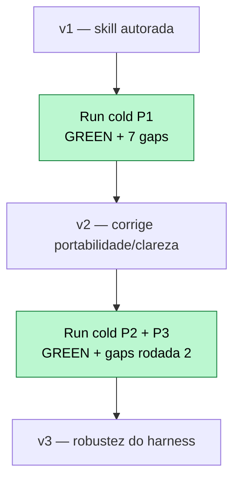

# Criação de Skills — Refatoração Arquitetural Automatizada

Skill `refactor-arch`: uma Skill do Claude Code que **analisa, audita e refatora**
qualquer projeto para o padrão **MVC**, de forma **agnóstica de tecnologia**.
Projeto do MBA em Engenharia de Software com IA — desafio descrito em
[`docs/SPEC.md`](docs/SPEC.md).

> **Status:** entregue. Skill em `<projeto>/.claude/skills/refactor-arch/`, os 3
> projetos refatorados para MVC e validados, 3 relatórios em [`reports/`](reports/).
> Decisões em [`docs/adr/`](docs/adr/), vocabulário em [`CONTEXT.md`](CONTEXT.md),
> plano em [`docs/ROADMAP.md`](docs/ROADMAP.md).

## Sumário

- [Visão geral](#visão-geral)
- [A) Análise Manual](#a-análise-manual)
- [B) Construção da Skill](#b-construção-da-skill)
- [C) Resultados](#c-resultados)
- [D) Como Executar](#d-como-executar)

## Visão geral

A skill roda em 3 fases sequenciais sobre o projeto onde é invocada:

```mermaid
flowchart LR
    A[Fase 1 — Análise<br/>detecta stack + mapeia arquitetura<br/>gera harness + baseline] --> B[Fase 2 — Auditoria<br/>cruza com o catálogo<br/>relatório por severidade]
    B --> C{Confirmação<br/>humana? [s/n]}
    C -- não --> X[Para. Nada muda]
    C -- sim --> D[Fase 3 — Refatoração<br/>reestrutura p/ MVC]
    D --> E{Harness<br/>verde?}
    E -- não --> D
    E -- sim --> F[Refatoração aceita]

    classDef gate fill:#fde68a,stroke:#b45309,color:#000
    classDef stop fill:#fecaca,stroke:#b91c1c,color:#000
    classDef done fill:#bbf7d0,stroke:#15803d,color:#000
    class C,E gate
    class X stop
    class F done
```

Projetos-alvo do desafio:

| Projeto | Stack | Domínio | Ponto de partida |
|---|---|---|---|
| `code-smells-project` | Python/Flask + SQLite | E-commerce API | Monólito (4 arquivos, zero camadas) |
| `ecommerce-api-legacy` | Node/Express + SQLite | LMS API com checkout | God Class + callback hell |
| `task-manager-api` | Python/Flask + SQLAlchemy | Task Manager | Parcialmente organizado (com vazamentos) |

**Como a skill foi validada (o diferencial deste trabalho):** a prova de que ela é
agnóstica não foi *afirmada* — foi *medida*. Cada projeto foi refatorado por um agente
em **contexto limpo**, escopado só ao diretório do projeto, proibido de ler qualquer
nota de planejamento — exatamente o cenário de um avaliador que copia a skill e a roda
do zero. Onde o agente cold tropeçou, a skill (não o projeto) foi corrigida. Foram
**3 iterações** (v1→v2→v3), o ciclo que o SPEC prevê.

---

## A) Análise Manual

Problemas identificados na leitura dos 3 projetos (insumo em
[`docs/research/findings-baseline.md`](docs/research/findings-baseline.md), confirmados e
expandidos pela auditoria da skill). Severidades conforme [`CONTEXT.md`](CONTEXT.md).
Auditoria completa por projeto em [`reports/`](reports/).

### code-smells-project (Python/Flask) — 17 achados (5C · 4H · 4M · 4L)

| Severidade | Problema | Arquivo:linha | Por que importa |
|---|---|---|---|
| CRITICAL | SQL Injection por concatenação | `models.py:28,47-50,109-111,289-297` | Input direto na query → injeção total, bypass de login |
| CRITICAL | Endpoint de SQL arbitrário + reset sem auth | `app.py:59-78,47-57` | `/admin/query` executa SQL cru; `/admin/reset-db` apaga tudo, anônimo |
| CRITICAL | `SECRET_KEY` hardcoded | `app.py:7` | Segredo versionado → sessões forjáveis |
| CRITICAL | Senha em texto plano | `database.py:75-83`, `models.py:105-129` | Vazamento expõe todas as senhas em claro |
| CRITICAL | Segredo/PII na resposta | `controllers.py:288-289`, `models.py:83,99` | `/health` vaza `secret_key`; `/usuarios` vaza `senha` |
| HIGH | God Module (4 domínios) | `models.py:1-315` | Impossível testar/alterar em isolamento |
| HIGH | Efeito/negócio no controller | `controllers.py:208-210,247-250` | E-mail/SMS preso ao HTTP, não-testável |
| HIGH | Debug mode ligado | `app.py:8,88` | Debugger executa código arbitrário |
| HIGH | Estado global mutável (conexão) | `database.py:4` | Corrida entre requests |
| MEDIUM | Query N+1 | `models.py:187-199,219-231` | Latência cresce com pedidos×itens |
| MEDIUM | Erro vazando `str(e)` (×17) | `controllers.py` (todos handlers) | Vaza interno + duplicação massiva |
| MEDIUM | Sem integridade no delete | `models.py:65-70` | Itens órfãos |
| MEDIUM | Validação duplicada inline | `controllers.py:28-54` vs `72-90` | Regras divergem entre endpoints |
| LOW | `print` como log · magic numbers · duplicação · nomes crípticos | vários | Legibilidade/manutenção |

### ecommerce-api-legacy (Node/Express) — 15 achados (4C · 4H · 4M · 3L)

| Severidade | Problema | Arquivo:linha | Por que importa |
|---|---|---|---|
| CRITICAL | Credenciais hardcoded | `utils.js:2-5` | `dbPass`, `pk_live_...`, `smtpUser` no código |
| CRITICAL | Hash de senha caseiro (`badCrypto`) | `utils.js:17-23` | base64 em loop, trunca em 10 chars; trivial |
| CRITICAL | Cartão + chave do gateway em log | `AppManager.js:45` | PII e segredo de pagamento logados |
| CRITICAL | DELETE destrutivo sem auth | `AppManager.js:131-137` | Apaga usuário anônimo, deixa órfãos |
| HIGH | God Class `AppManager` | `AppManager.js:4-141` | initDb + rotas + pagamento + relatório juntos |
| HIGH | Negócio/efeito no handler de checkout | `AppManager.js:43-78` | Pagamento e hashing presos à rota |
| HIGH | Estado global mutável | `utils.js:9-15` | `globalCache`, `totalRevenue` compartilhados |
| HIGH | Validação de pagamento ingênua | `AppManager.js:46` | Cartão "válido" se começa com "4" |
| MEDIUM | N+1 no relatório financeiro | `AppManager.js:83-127` | Query por curso × matrícula × usuário |
| MEDIUM | Callback hell / API sqlite3 deprecated | `AppManager.js:37-77` | Pirâmide de callbacks aninhados |
| MEDIUM | Sem integridade no delete | `AppManager.js:133-135` | Matrículas/pagamentos órfãos |
| MEDIUM | Erro espalhado, sem middleware | `AppManager.js:38,51,70,84` | Sem tratamento central |
| LOW | Nomes crípticos · magic numbers · `console.log` | vários | Legibilidade |

### task-manager-api (Python/Flask, parcialmente organizado) — 13 achados (3C · 2H · 4M · 4L)

| Severidade | Problema | Arquivo:linha | Por que importa |
|---|---|---|---|
| CRITICAL | Segredos hardcoded (SECRET_KEY + SMTP) | `app.py:13`, `notification_service.py:9-10` | Segredo no código; senha SMTP `senha123` |
| CRITICAL | Hash de senha md5 (deprecated p/ senha) | `models/user.py:27-32` | md5 é rápido → quebrável por força bruta |
| CRITICAL | Hash de senha exposto no `to_dict` | `models/user.py:16-25` | `GET /users/<id>`, `/login` vazam o hash |
| HIGH | Debug mode ligado | `app.py:34` | `app.run(debug=True)` em "produção" |
| HIGH | Lógica de negócio nas rotas | `task_routes.py:30-48`, `report_routes.py` | `overdue` duplicado, agregação no handler |
| MEDIUM | Query N+1 | `task_routes.py:41-57`, `report_routes.py:55-68` | Query de user/category por task |
| MEDIUM | Erro espalhado / `except` nu | `task_routes.py:62,236-238` | Sem handler central, mascara bug |
| MEDIUM | `db.create_all()` em tempo de import | `app.py:30-31` | Efeito colateral no import |
| MEDIUM | Validação duplicada + validador morto | `task_routes.py:96-114` vs `166-184`; `helpers.py:57-108` | Regras divergem; código morto |
| LOW | `datetime.utcnow()` deprecated (pervasivo) | `models`, `routes`, `helpers.py` | Depreciado no Python 3.12+ → `now(timezone.utc)` |
| LOW | `print` como log · nomes crípticos · magic numbers | vários | Legibilidade |

---

## B) Construção da Skill

### Decisões de design (estrutura do SKILL.md + reference files)

`SKILL.md` é um conjunto de **steps** (as 3 fases em ordem, cada uma com um critério de
completude *checável*) com **progressive disclosure** para 5 reference files — o
conhecimento de domínio carregado sob demanda em cada fase. As 5 áreas obrigatórias:

| Área | Arquivo | Conteúdo |
|---|---|---|
| Análise de projeto | `references/analysis.md` | Heurísticas de detecção (linguagem por manifesto, framework por import, banco por driver) + route map |
| Catálogo de anti-patterns | `references/anti-patterns.md` | **19 anti-patterns** + régua de severidade inline + seção de **APIs deprecated** |
| Template de relatório | `references/report-template.md` | Formato padronizado da Fase 2 |
| Guidelines de arquitetura | `references/mvc-guidelines.md` | Responsabilidade de cada camada MVC + exceção do harness |
| Playbook de refatoração | `references/playbook.md` | **11 transformações** antes/depois |

Princípios do `/writing-great-skills` aplicados: **leading words** (`Análise`,
`Auditoria`, `Refatoração`, `harness`, `baseline`, `verde`) que ancoram comportamento;
critérios de completude exaustivos para evitar *premature completion*; régua de
severidade **inline** (não dependente de arquivo externo que não viaja na cópia).

### Catálogo de anti-patterns — quais e por quê

19 entradas com **severidade distribuída** (5 CRITICAL, 5 HIGH, 5 MEDIUM, 4 LOW) + uma
seção dedicada de **APIs deprecated** (`datetime.utcnow()`, md5/sha1 p/ senha, callback
do sqlite3, etc.). Semeado a partir dos problemas reais dos 3 projetos e do OWASP API
Top 10. Cada entrada é **dual-stack**: um *princípio agnóstico* ("nunca concatene input
em query") + *sinais de detecção por stack* (Flask e Express) + impacto. São sinais
**acionáveis** (`cursor.execute("..." + var)`, `db.run("..." + v)`), não "código ruim".

### Agnosticidade de tecnologia ([ADR-0001](docs/adr/0001-agnosticidade-entre-stacks.md))

Uma skill só, copiada para os 3 projetos. A Fase 1 **detecta** a stack; catálogo e
playbook expressam cada item de forma **dupla** (princípio + exemplos por stack); o
**harness opera no nível HTTP**, agnóstico por construção. "Funciona nos 3" é uma
propriedade **provada** pelo harness verde, não afirmada.

### Validação como harness de caracterização ([ADR-0003](docs/adr/0003-validacao-harness-como-gate-tdd.md))

A Fase 1 gera um harness que sobe o app e bate em todos os endpoints, gravando o
**baseline** (classe de status + shape) **antes** de qualquer mudança — a peça "teste que
falha primeiro" do TDD. A Fase 3 re-roda e exige **verde**: a *classe de status* de cada
endpoint idêntica ao baseline; shape comparado de forma frouxa (tolera campos sensíveis
removidos, ex: `senha`). Mudança de status **intencional** por segurança (auth num
endpoint destrutivo) é permitida com re-baseline + documentação.

### Desafios e como foram resolvidos (a jornada de iteração)

O risco central (ADR-0001) é a skill ficar **acoplada** a um projeto. O antídoto foi
**inverter o loop**: em vez de eu refatorar (já contaminado pela leitura dos 3 projetos),
cada projeto foi rodado por um **agente cold**, escopado ao projeto, que também *reporta
onde a skill falhou*. Isso virou 3 iterações:



- **v1→v2 (gaps do P1):** a régua de severidade deferia a um arquivo que **não viajava
  na cópia** → inlinada. O gate de status-class *forçava manter uma vuln aberta* (admin
  endpoints) só para o 200 bater → criada a **exceção de hardening intencional**. Harness
  sem `Content-Type: application/json` dava 415→500 → documentado.
- **v2→v3 (gaps do P2/P3):** boot do harness quando o app não é importável → fallback
  por subprocess; semear dados antes do baseline; caracterizar corpo **array/texto**;
  deixar claro que o GREEN cobre só o *caminho feliz*; `crypto.scrypt` stdlib como
  alternativa ao `bcrypt` (sem build nativo).

Cada gap foi achado por *não saber nada do projeto* — exatamente o que um avaliador
veria. A skill final é mais robusta porque a validação foi adversarial, não complacente.

---

## C) Resultados

### Resumo dos relatórios de auditoria

| Projeto | CRITICAL | HIGH | MEDIUM | LOW | Total | Harness | Verificação adversarial |
|---|:--:|:--:|:--:|:--:|:--:|:--:|:--:|
| code-smells-project | 5 | 4 | 4 | 4 | **17** | 🟢 19 endpoints | 🟢 |
| ecommerce-api-legacy | 4 | 4 | 4 | 3 | **15** | 🟢 3 endpoints | 🟢 PASS |
| task-manager-api | 3 | 2 | 4 | 4 | **13** | 🟢 22 endpoints | 🟢 PASS |

Todos atingem os **critérios de aceite** (3/3 projetos): Fase 1 detecta a stack; Fase 2
acha ≥5 achados com ≥1 CRITICAL/HIGH; Fase 3 mantém a aplicação de pé (harness verde).

### Antes / depois da estrutura

**code-smells-project** — de monólito a MVC:
```
ANTES                          DEPOIS
app.py                         app.py (composition root)
controllers.py                 config/settings.py
models.py            ───►      models/{produto,usuario,pedido,relatorio}_model.py
database.py                    views/routes.py
                               controllers/{produto,usuario,pedido,relatorio,system,admin}_controller.py
                               services/notification_service.py
                               middlewares/error_handler.py
                               database/connection.py · harness/
```

**ecommerce-api-legacy** — de God Class a MVC (3 → 20 arquivos):
```
ANTES                          DEPOIS (src/)
src/app.js                     app.js (entry) · appFactory.js (composition root)
src/AppManager.js    ───►      config/ · db/{database,seed}.js · models/ (6)
src/utils.js                   controllers/ (3) · services/ (password, payment)
                               routes/ · middlewares/ (auth, error) · logger.js · harness/
```

**task-manager-api** — vazamentos corrigidos sobre a organização existente:
```
ANTES                          DEPOIS (+ correções in-place)
app.py · database.py           + config/settings.py
models/ (3)          ───►      + controllers/ (5)   ← lógica saiu das rotas
routes/ (3)                    + middlewares/error_handler.py
services/ · utils/             models/ md5→werkzeug, to_dict sem password, utcnow→aware
                               routes/ viram Views finas · app.py composition root · harness/
```

### Checklist de Validação preenchido (×3)

| Item | P1 | P2 | P3 |
|---|:--:|:--:|:--:|
| **Fase 1** — Linguagem/framework detectados | ✅ | ✅ | ✅ |
| Domínio descrito corretamente | ✅ | ✅ | ✅ |
| Nº de arquivos condiz | ✅ | ✅ | ✅ |
| **Fase 2** — Relatório segue o template | ✅ | ✅ | ✅ |
| Cada finding com arquivo:linha | ✅ | ✅ | ✅ |
| Ordenado por severidade | ✅ | ✅ | ✅ |
| ≥5 findings · ≥1 CRITICAL/HIGH | ✅ | ✅ | ✅ |
| Detecção de APIs deprecated | ✅ | ✅ | ✅ (`datetime.utcnow()`) |
| Pausa pedindo confirmação | ✅ | ✅ | ✅ |
| **Fase 3** — Estrutura MVC | ✅ | ✅ | ✅ |
| Config sem hardcoded | ✅ | ✅ | ✅ |
| Models / Views-Rotas / Controllers | ✅ | ✅ | ✅ |
| Erro centralizado · entry point claro | ✅ | ✅ | ✅ |
| App inicia sem erros | ✅ | ✅ | ✅ |
| Endpoints originais respondem | ✅ | ✅ | ✅ |

### Apps rodando após refatoração (harness)

Saída real do harness de caracterização do **P1** (re-rodado pós-refatoração):
```
captured 19 endpoints -> harness/post.json
  2xx  GET    /                    2xx  POST   /login          2xx  GET    /relatorios/vendas
  2xx  GET    /health              2xx  POST   /produtos       4xx  POST   /admin/query    (removido)
  2xx  GET    /produtos            ... (17 endpoints 2xx)      4xx  POST   /admin/reset-db (auth)
--- COMPARE vs baseline ---
Tolerated shape changes: GET /health: removed=['ambiente','db_path','debug','secret_key']
GREEN — every endpoint preserved its status class.
```
P2 (`node harness/run.js verify`) e P3 (`PYTHONPATH=. python harness/characterize.py ... --compare`)
re-rodaram **GREEN** da mesma forma. Cada refatoração passou ainda por um **verificador
adversarial** independente (boot + endpoints + grep de segredo/SQLi/hash fraco): ambos **PASS**.

### Observações por stack

- **Flask monólito (P1):** o trabalho pesado é *criar* as camadas do zero e parametrizar
  100% das queries. O caso mais instrutivo foi o *gate vs. segurança*: corrigir os
  endpoints admin **muda** a classe de status — a skill ganhou a regra de que endereçar o
  achado vence o contrato (hardening + re-baseline), nunca o contrário.
- **Node/Express (P2):** a transformação característica é **callback hell → async/await**
  (promisificando o `sqlite3`). O `bcrypt` tem build nativo chato → `crypto.scrypt` stdlib.
- **Flask parcialmente organizado (P3):** a refatoração **não recria** o que existe —
  corrige vazamentos (lógica na rota → controller, `db.create_all()` no import →
  composition root, md5 → hash forte, `datetime.utcnow()` → timezone-aware).

---

## D) Como Executar

### Pré-requisitos

- [Claude Code](https://docs.anthropic.com/en/docs/claude-code/overview) instalado e configurado
- Python 3.12+ (projetos Flask) e Node.js 18+ (projeto Express)

### Rodar a skill em cada projeto

A skill já está em `<projeto>/.claude/skills/refactor-arch/`. Dentro de cada projeto:

```bash
cd code-smells-project   && claude "/refactor-arch"
cd ../ecommerce-api-legacy && claude "/refactor-arch"
cd ../task-manager-api     && claude "/refactor-arch"
```

A Fase 2 pausa pedindo confirmação `[s/n]` e salva o relatório em
`reports/audit-project-{1,2,3}.md` (agregados na raiz [`reports/`](reports/)).

### Validar a refatoração (harness de caracterização)

Cada projeto traz o harness que a skill gerou. Re-rodá-lo prova que os endpoints
continuam respondendo com a mesma classe de status:

```bash
# P1 — code-smells-project (Flask)
cd code-smells-project && pip install -r requirements.txt
python harness/characterize.py --out harness/post.json --baseline harness/baseline.json   # espera: GREEN

# P2 — ecommerce-api-legacy (Node)
cd ecommerce-api-legacy && npm install
node harness/run.js verify                                                                 # espera: GREEN

# P3 — task-manager-api (Flask)
cd task-manager-api && pip install -r requirements.txt && python seed.py
PYTHONPATH=. python harness/characterize.py harness/postrefactor.json --compare harness/baseline.json
```

Rodar os apps diretamente: `python app.py` (Flask, P1/P3) ou `node src/app.js` (P2).
Segredos e `DEBUG` vêm do ambiente (`SECRET_KEY`, `DEBUG`, `ADMIN_TOKEN`, …); há defaults
só-de-dev para subir com um comando.
