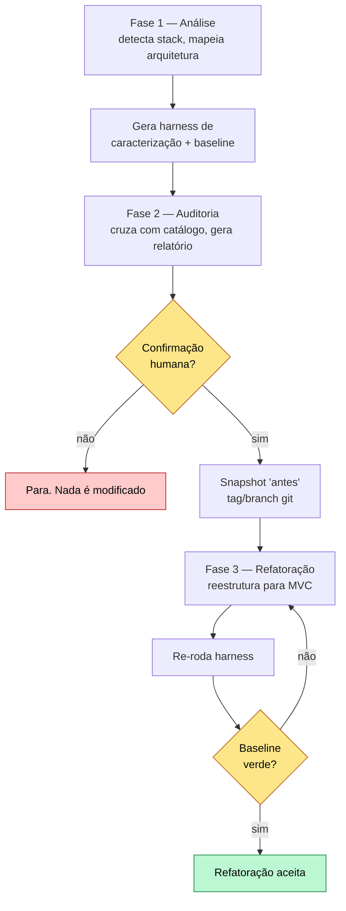

# ROADMAP — Skill `refactor-arch`

Passo a passo rastreável para implementar 100% do [`docs/SPEC.md`](./SPEC.md): uma
skill que **analisa → audita → refatora** qualquer projeto para MVC, agnóstica de
stack, validada nos 3 projetos do desafio.

**Como ler:** `[ ]` pendente · `[~]` em andamento · `[x]` concluído. Cada item liga
a um requisito do SPEC. A seção [Rastreabilidade ↔ SPEC](#rastreabilidade--spec)
prova que nada do SPEC ficou de fora. Decisões fundadoras: [ADR-0001](./adr/0001-agnosticidade-entre-stacks.md)
(agnosticidade), [ADR-0002](./adr/0002-skill-canonica-na-raiz-com-sync.md) (sync),
[ADR-0003](./adr/0003-validacao-harness-como-gate-tdd.md) (validação/TDD).
Vocabulário em [CONTEXT.md](../CONTEXT.md). Idioma e disciplina de docs em
[DOCUMENTACAO.md](./DOCUMENTACAO.md).

---

> ## ✅ ENTREGUE
> Skill `refactor-arch` autorada e **validada em contexto
> limpo** nos 3 projetos por agentes cold + verificação adversarial — **3/3 GREEN**.
> Foram **3 iterações** (v1→v2→v3) guiadas pelos gaps que cada run cold expôs.
> Os checkboxes granulares abaixo ficam como histórico; a fonte de verdade do "pronto"
> é a tabela de [Critérios de Aceite](#critérios-de-aceite-gate-final--verbatim-do-spec).
>
> | | Stack | Achados | Harness | Verify |
> |---|---|---|:--:|:--:|
> | P1 code-smells | Flask monólito | 17 (5C/4H/4M/4L) | 🟢 19 ep | 🟢 |
> | P2 ecommerce | Node/Express | 15 (4C/4H/4M/3L) | 🟢 3 ep | 🟢 PASS |
> | P3 task-manager | Flask parcial | 13 (3C/2H/4M/4L) | 🟢 22 ep | 🟢 PASS |

---

## Fluxo da skill (alvo)



---

## Fase 0 — Planejamento, alinhamento & pesquisa  _(esta sessão)_

- [x] Grilling: 6 decisões fechadas (idioma, casa da skill, validação/TDD, autoria do harness, catálogo/playbook, pesquisa)
- [x] [CONTEXT.md](../CONTEXT.md) — glossário do domínio da skill
- [x] ADRs [0001](./adr/0001-agnosticidade-entre-stacks.md) · [0002](./adr/0002-skill-canonica-na-raiz-com-sync.md) · [0003](./adr/0003-validacao-harness-como-gate-tdd.md)
- [x] Este ROADMAP
- [x] Esqueleto do [README.md](../README.md)
- [x] [DOCUMENTACAO.md](./DOCUMENTACAO.md) + template de dev-log
- [x] `.claude/rules/` via `/create-rule` — `refactor-arch-skill.md` + `audit-reports.md`
- [x] Workflow de pesquisa web → [`docs/research/2026-06-29-digest-pesquisa.md`](./research/2026-06-29-digest-pesquisa.md)
- [x] `.gitignore` ancorado em `/.claude/` (root): a skill canônica + rules da raiz ficam **fora** do git (fonte de dev), e as **cópias nos 3 projetos** (`<projeto>/.claude/skills/refactor-arch/`) ficam **rastreáveis/commitáveis**, como exige o SPEC.

> **Saída desta fase:** docs de planejamento. **Nada** da skill é implementado aqui.

---

## Fase 1 — Análise manual dos 3 projetos  _(SPEC §1)_

Entender os problemas antes de codar a detecção. Documentar na seção **Análise
Manual** do README. Mínimo por projeto: **≥5 problemas**, sendo **≥1 CRITICAL/HIGH,
≥2 MEDIUM, ≥2 LOW**.

- [x] **code-smells-project** (Python/Flask, e-commerce) — 17 problemas classificados e justificados (README §A)
- [x] **ecommerce-api-legacy** (Node/Express, LMS+checkout) — 15 problemas classificados e justificados (README §A)
- [x] **task-manager-api** (Python/Flask, parcialmente organizado) — 13 problemas classificados e justificados (README §A)

> **Insumo pronto:** [`docs/research/findings-baseline.md`](./research/findings-baseline.md)
> já traz achados localizados (arquivo:linha) por projeto, descobertos no
> planejamento. A Fase 1 confirma, expande e completa (Projeto 3 foi lido só
> parcialmente).

---

## Fase 2 — Construção da skill  _(SPEC §2)_

Cópia canônica em `.claude/skills/refactor-arch/` na raiz ([ADR-0002](./adr/0002-skill-canonica-na-raiz-com-sync.md)).

### 2.1 — Estrutura

- [x] `SKILL.md` com as **3 fases sequenciais** (Análise → Auditoria → Refatoração) e nome `refactor-arch` (obrigatório, não alterar)
- [x] Reference files cobrindo as **5 áreas de conhecimento obrigatórias** (tabela abaixo)
- [x] `scripts/sync-skill.sh` espelhando a skill nos 3 projetos

| Área de conhecimento | Reference file (sugerido) | Cobre |
|---|---|---|
| Análise de projeto | `references/analysis.md` | heurísticas de detecção de linguagem/framework/banco e mapeamento de arquitetura |
| Catálogo de anti-patterns | `references/anti-patterns.md` | anti-patterns com sinais de detecção + severidade |
| Template de relatório | `references/report-template.md` | formato padronizado do relatório (Fase 2) |
| Guidelines de arquitetura | `references/mvc-guidelines.md` | regras do MVC alvo (responsabilidades de cada camada) |
| Playbook de refatoração | `references/playbook.md` | transformações antes/depois por anti-pattern |

### 2.2 — Catálogo (`anti-patterns.md`) — **entregue: 19**

- [x] **19** anti-patterns com **severidade distribuída** (5 CRITICAL / 5 HIGH / 5 MEDIUM / 4 LOW)
- [x] Inclui **detecção de APIs deprecated** (seção dedicada; ex: `datetime.utcnow()` → `datetime.now(timezone.utc)`)
- [x] Cada anti-pattern com sinais de detecção **acionáveis por stack** (exemplos Flask + Express), não "código ruim"
- [x] Semeado dos anti-patterns **reais dos 3 projetos** + OWASP API Top 10 (digest de pesquisa) + régua de severidade inline

### 2.3 — Playbook (`playbook.md`) — **entregue: 11**

- [x] **11** transformações com **exemplos de código antes/depois**
- [x] Cobre os de maior impacto: SQLi→parametrizado, God Class→MVC, segredo→config/env, senha→hash, callback hell→async/await, N+1→join/batch, lógica-no-controller→service, debug→env-gated
- [x] Exemplos **por stack** (Flask/SQLite e Express/SQLite), conforme [ADR-0001](./adr/0001-agnosticidade-entre-stacks.md)

### 2.4 — Comportamento obrigatório da skill

- [x] **Fase 2 pausa e pede confirmação** antes de modificar qualquer arquivo
- [x] **Fase 3 gera o harness** na Fase 1 e o re-roda para validar (boot + endpoints) — [ADR-0003](./adr/0003-validacao-harness-como-gate-tdd.md)
- [x] Skill **agnóstica**: nada hardcoded para um projeto específico — [ADR-0001](./adr/0001-agnosticidade-entre-stacks.md)

### 2.5 — Aprofundamento (deep-research)

- [x] Aprofundamento feito pelo **loop empírico de validação cold** (3 iterações v1→v2→v3): em vez de um passo de deep-research web, cada run cold expôs gaps reais da skill que refinaram catálogo/playbook/harness — sinal mais forte que pesquisa (ver [dev-log](./dev-log/2026-06-29-implementacao-skill-3-iteracoes.md))

---

## Fase 3 — Execução nos 3 projetos  _(SPEC §3)_

Para **cada** projeto: sync da skill → snapshot "antes" → rodar `/refactor-arch` →
salvar relatório → commitar. O snapshot "antes" preserva o estado para o comparativo
do README (seção C) — a Fase 3 sobrescreve a estrutura.

> **Rede de segurança (realizada):** cada refatoração passou por **verificação adversarial
> independente** — um agente em contexto limpo por projeto que tenta provar que o refactor
> não está seguro/de pé (boot + endpoints + grep de segredo/SQLi/hash fraco), mais uma
> revisão adversarial final do P1 — todos **PASS**. A auditoria do código legado é da
> própria skill (Fase 2). SAST ativo sobre o legado (plugin `security-scanning`) ficou
> **fora de escopo** por decisão de projeto.

### Projeto 1 — code-smells-project (Python/Flask)

- [x] `sync-skill.sh` copiou a skill para o projeto
- [x] Snapshot "antes" — estrutura original no histórico git + comparativo antes/depois no README §C
- [x] Fase 1 detecta stack e imprime resumo
- [x] Fase 2 encontra **17** achados (≥5) com arquivo:linha
- [x] Confirmação dada; Fase 3 executada
- [x] Relatório salvo em `reports/audit-project-1.md`
- [x] Código refatorado commitado (`80b16ac`)
- [x] **Checklist de Validação** preenchido (README §C)

### Projeto 2 — ecommerce-api-legacy (Node/Express)

- [x] `.claude/skills/refactor-arch/` copiada para o projeto
- [x] Snapshot "antes" — histórico git + comparativo no README §C
- [x] 3 fases executam corretamente nesta stack diferente (15 achados, harness verde)
- [x] Relatório salvo em `reports/audit-project-2.md`
- [x] Código refatorado commitado (`cc1fea7`)
- [x] **Checklist de Validação** preenchido (README §C)

### Projeto 3 — task-manager-api (Python/Flask, parcialmente organizado)

- [x] `.claude/skills/refactor-arch/` copiada para o projeto
- [x] Snapshot "antes" — histórico git + comparativo no README §C
- [x] Fase 1 detecta Python/Flask e identifica o domínio Task Manager
- [x] Fase 2 identifica problemas mesmo num projeto parcialmente organizado (13 achados)
- [x] Fase 3 melhora a estrutura **sem quebrar** a aplicação (harness verde, 22 endpoints)
- [x] Relatório salvo em `reports/audit-project-3.md`
- [x] Código refatorado commitado (`d91f929`)
- [x] **Checklist de Validação** preenchido (README §C)

### Checklist de Validação  _(verbatim do SPEC — replicar por projeto)_

> **Preenchido ✅ ×3 na [seção C do README](../README.md#c-resultados).** O bloco abaixo é o template de referência (em branco).

```markdown
### Fase 1 — Análise
- [ ] Linguagem detectada corretamente
- [ ] Framework detectado corretamente
- [ ] Domínio da aplicação descrito corretamente
- [ ] Número de arquivos analisados condiz com a realidade

### Fase 2 — Auditoria
- [ ] Relatório segue o template definido nos arquivos de referência
- [ ] Cada finding tem arquivo e linhas exatos
- [ ] Findings ordenados por severidade (CRITICAL → LOW)
- [ ] Mínimo de 5 findings identificados
- [ ] Detecção de APIs deprecated incluída (se aplicável)
- [ ] Skill pausa e pede confirmação antes da Fase 3

### Fase 3 — Refatoração
- [ ] Estrutura de diretórios segue padrão MVC
- [ ] Configuração extraída para módulo de config (sem hardcoded)
- [ ] Models criados para abstrair dados
- [ ] Views/Routes separadas para visualização ou roteamento
- [ ] Controllers concentram o fluxo da aplicação
- [ ] Error handling centralizado
- [ ] Entry point claro
- [ ] Aplicação inicia sem erros
- [ ] Endpoints originais respondem corretamente
```

---

## Fase 4 — Documentação final & entrega

- [x] README seção **A) Análise Manual** (Fase 1)
- [x] README seção **B) Construção da Skill** (decisões de design, anti-patterns, agnosticidade, desafios)
- [x] README seção **C) Resultados** (resumo dos relatórios, antes/depois, checklist preenchido ×3, logs das apps rodando)
- [x] README seção **D) Como Executar** (pré-requisitos, comandos por projeto, como validar)
- [x] Dev-log atualizado ([DOCUMENTACAO.md](./DOCUMENTACAO.md))
- [x] README + ROADMAP em sync
- [x] **Publicação:** push + repositório **público** no GitHub (fork), com todos os entregáveis

---

## Critérios de Aceite  _(gate final — verbatim do SPEC)_

Mínimos em **todos os 3 projetos**:

| Critério | Requisito | P1 | P2 | P3 |
|---|---|:--:|:--:|:--:|
| Fase 1 detecta stack corretamente | OBRIGATÓRIO | [x] | [x] | [x] |
| Fase 2 encontra ≥ 5 findings | OBRIGATÓRIO | [x] (17) | [x] (15) | [x] (13) |
| Fase 2 inclui ≥ 1 CRITICAL ou HIGH | OBRIGATÓRIO | [x] | [x] | [x] |
| Fase 3 app funciona após refatoração | OBRIGATÓRIO | [x] | [x] | [x] |

---

## Entregáveis  _(SPEC §Entregável)_

- [x] Skill completa em `.claude/skills/refactor-arch/` **dentro dos 3 projetos**
- [x] Código refatorado dos 3 projetos commitado
- [x] `reports/audit-project-{1,2,3}.md` (3 relatórios)
- [x] `README.md` atualizado (seções A/B/C/D)
- [x] Repositório **público** no GitHub (fork) com tudo acima

---

## Rastreabilidade ↔ SPEC

| Requisito do SPEC | Onde é honrado |
|---|---|
| Skill analisa/audita/refatora para MVC, agnóstica | Fases 2-3 · [ADR-0001](./adr/0001-agnosticidade-entre-stacks.md) |
| Severidades CRITICAL/HIGH/MEDIUM/LOW | [CONTEXT.md](../CONTEXT.md) · catálogo (2.2) |
| Análise manual ≥5 problemas/projeto (1 CRIT/HIGH, 2 MED, 2 LOW) | Fase 1 · README A |
| SKILL.md com 3 fases sequenciais | 2.1 |
| 5 áreas de conhecimento em reference files | 2.1 (tabela) |
| Catálogo ≥8, severidade distribuída | 2.2 |
| Catálogo detecta APIs deprecated | 2.2 |
| Playbook ≥8 antes/depois | 2.3 |
| Fase 2 pausa para confirmação | 2.4 |
| Fase 3 valida (boot + endpoints) | 2.4 · [ADR-0003](./adr/0003-validacao-harness-como-gate-tdd.md) |
| Execução + relatório + commit nos 3 projetos | Fase 3 |
| Checklist de Validação por projeto | Fase 3 |
| Critérios de Aceite 3/3 | Gate final |
| README A/B/C/D | Fase 4 |
